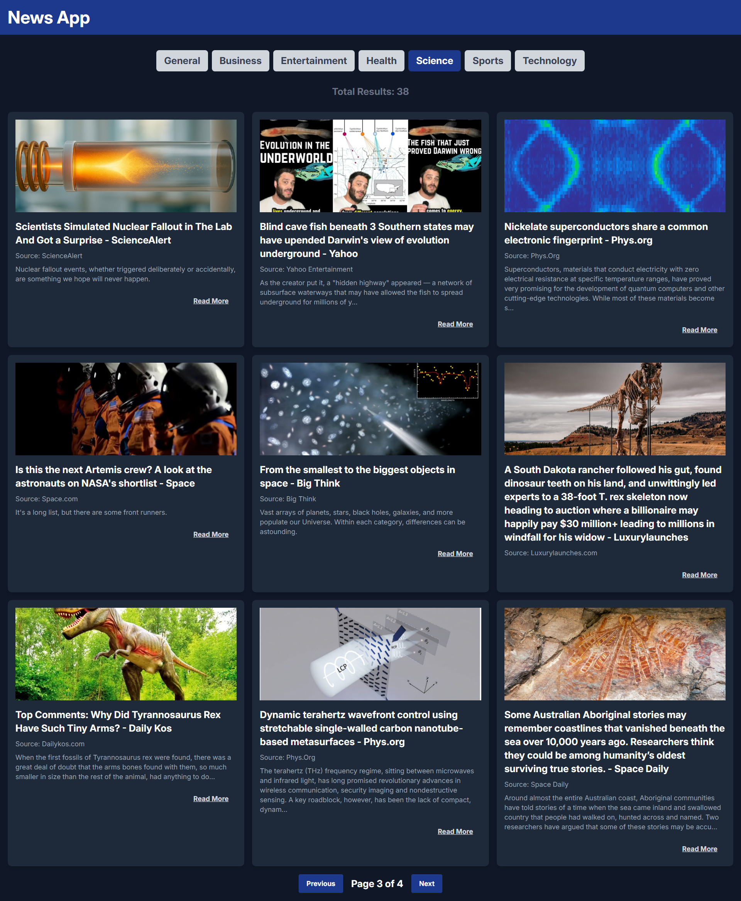

# 📰 React News App

A modern, fast, and responsive React web application that fetches and displays the latest top headlines from around the world using the [NewsAPI](https://newsapi.org/). Built with React 19, Vite, Tailwind CSS v4, and DaisyUI v5.



---

## ✨ Features

- **Real-time News Fetching**: Pulls current top headlines dynamically from multiple categories.
- **Category Filtering**: Seamlessly filter articles across 7 different topics:
  - 🌐 General
  - 💼 Business
  - 🎬 Entertainment
  - 🏥 Health
  - 🧪 Science
  - ⚽ Sports
  - 💻 Technology
- **Pagination**: Browse articles efficiently with custom pagination controls.
- **Responsive Grid Layout**: Adaptive design optimized for mobile, tablet, and desktop screens.
- **Modern UI**: Styled with Tailwind CSS v4 and DaisyUI v5 for a clean, sleek dark-themed interface.
- **Fast Development Cycle**: Powered by Vite with hot module replacement (HMR).

---

## 🛠️ Tech Stack

- **Framework**: [React 19](https://react.dev/)
- **Build Tool**: [Vite](https://vite.dev/)
- **Styling**: [Tailwind CSS v4](https://tailwindcss.com/) & [DaisyUI v5](https://daisyui.com/)
- **HTTP Client**: [Axios](https://axios-http.com/)
- **API Provider**: [NewsAPI](https://newsapi.org/)

---

## 🚀 Getting Started

Follow these instructions to set up the project locally on your machine.

### Prerequisites

Make sure you have [Node.js](https://nodejs.org/) (v18.0.0 or higher recommended) and npm installed.

### 1. Clone the Repository

```bash
git clone https://github.com/your-username/react-news-app.git
cd react-news-app
```

### 2. Install Dependencies

```bash
npm install
```

### 3. Get a NewsAPI Key

1. Go to [NewsAPI.org](https://newsapi.org/) and register for a free account.
2. Copy your API Key from the dashboard.

### 4. Configure Environment Variables

Create a file named `.env` in the root of the project and add your API key:

```env
VITE_NEWS_API_KEY=your_news_api_key_here
```

### 5. Run the Development Server

Start the local server to preview and edit the app:

```bash
npm run dev
```

Open your browser and navigate to `http://localhost:5173` (or the port specified in your console).

### 6. Build for Production

To create an optimized production build of the project, run:

```bash
npm run build
```

The compiled files will be saved in the `dist/` directory, ready for hosting.

---

## 📁 Project Structure

```text
react-news-app/
├── public/                 # Static assets
├── src/
│   ├── assets/             # Images, icons, and logo assets
│   ├── components/         # Reusable UI components
│   │   ├── CategorySelector.jsx # Category buttons filter
│   │   ├── NewsCard.jsx         # Card component for individual news article
│   │   ├── NewsList.jsx         # Grid wrapper for news cards
│   │   └── Pagination.jsx       # Prev/Next navigation controls
│   ├── App.jsx             # Main container & state management logic
│   ├── index.css           # Global Tailwind directives & configurations
│   └── main.jsx            # Application entry point
├── .env                    # Environment variables (git-ignored)
├── eslint.config.js        # ESLint configuration
├── vite.config.js          # Vite configuration
├── package.json            # Scripts and dependency declarations
└── README.md               # Project documentation
```

---

## 🔒 License

This project is open-source and available under the [MIT License](LICENSE).
